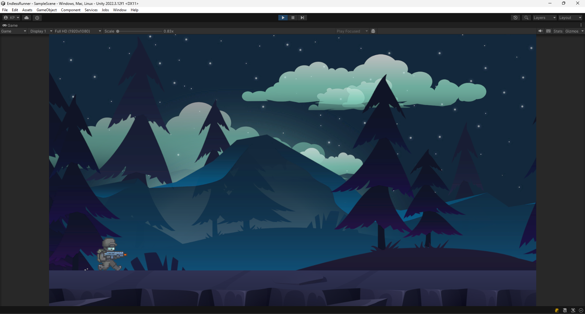
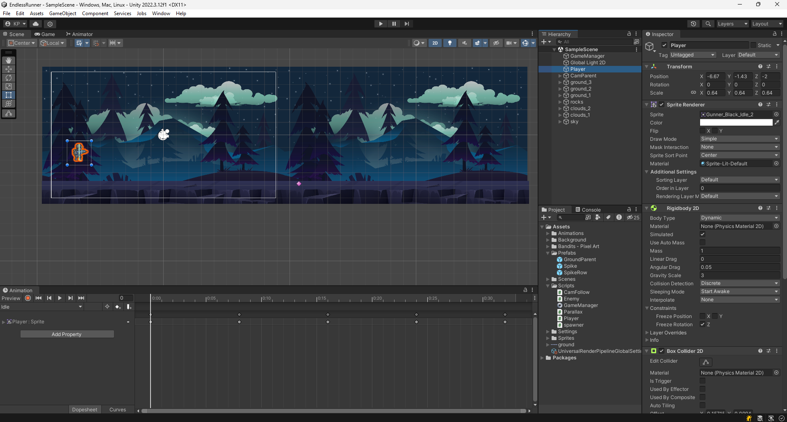
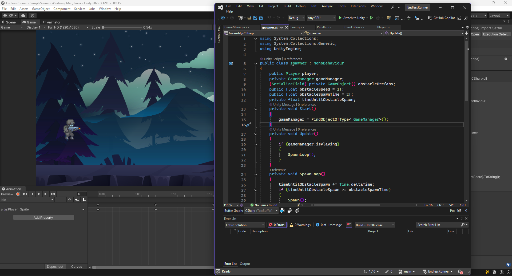

# Pixel Dash

## Overview
**Pixel Dash** is a **fast-paced infinite runner** built in **Unity**, where players control a pixelated character dashing through an endless course filled with obstacles. The goal is to survive as long as possible while increasing the score by dodging and collecting power-ups.

## Features
- **Endless gameplay**: Test your reflexes and see how far you can go!
- **Simple yet challenging mechanics**: Jump, slide, and dash to avoid obstacles.
- **Pixel-art style visuals**: Retro-inspired aesthetic for a nostalgic feel.
- **Dynamic difficulty**: The game speeds up over time, increasing the challenge.
- **Power-ups**: Collect boosts and special abilities to enhance your run.

## Controls
| Action | Control |
|--------|---------|
| Jump | Spacebar / Gamepad A Button |
| Slide | Down Arrow / S Key / Gamepad B Button |
| Dash | Right Arrow / D Key / Gamepad X Button |

## Development Details
- **Engine:** Unity
- **Programming Language:** C#
- **Game Type:** Infinite Runner

## Repository Contents
Due to the large file size of the full Unity project, only the **C# scripts** and a few **images** from the Unity engine and game are included in this repository.

### What's Included:
- C# scripts for game mechanics (character movement, collision detection, UI, etc.)
- Screenshots of the game and Unity environment

### What's Not Included:
- Full Unity project files (Assets, Scenes, Textures, Models, etc.)
- Build files or executables

## Screenshots

## Running the Code
If you'd like to explore the game's functionality:
1. Open **Unity** (compatible version used in development recommended).
2. Create a new **2D project**.
3. Copy the provided **C# scripts** into the **Assets/Scripts** folder.
4. Integrate the scripts with Unity objects accordingly.
5. Playtest and refine your reflexes in the infinite running challenge!

## Future Improvements
- Adding different themes and backgrounds for variety.
- Implementing more types of power-ups and obstacles.
- Introducing leaderboards and achievements.
- Enhancing animations and sound effects.

## License
This project is released under the **MIT License**. Feel free to modify and expand on it!

## Contact
If you have any questions or want to contribute, feel free to reach out!

Enjoy the Dash! 🚀🎮

